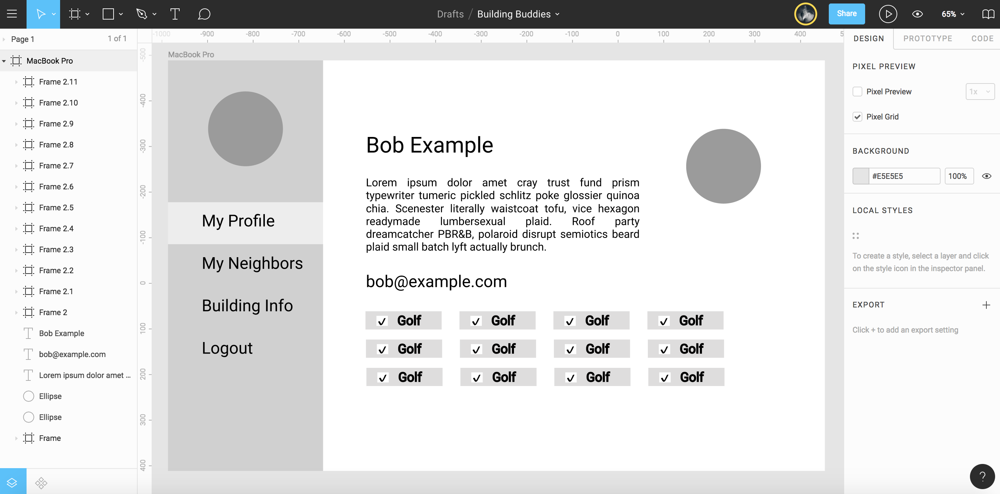

# Building Buddies

[Project](http://frontend.turing.io/projects/build-your-own-backend.html) that allows neighbors to find each other based on similar interests. [Back-end](https://github.com/laurakwhit/building-buddies-api) built using Express, knex, and PostgreSQL with data scraped from [Appartment List](https://www.apartmentlist.com/co/denver/). Front-end built using [React](https://github.com/facebook/create-react-app).

Launch Application --> [Here](https://building-buddies.herokuapp.com/)

## Set Up

Clone down [back-end](https://github.com/laurakwhit/building-buddies-api)

Run npm install and npm start (App should be running on localhost:5000)

Clone down this repo making sure it is next to (not inside) the back-end directory

Run npm install from the root directory

Run npm start and visit localhost:3000 in your browser

You can run tests with npm test in both front-end and back-end directories

## Wireframe

## Result

## Contributors

- [Gray Smith](https://github.com/graysmith00)
- [Laura Whitaker](https://github.com/laurakwhit)
